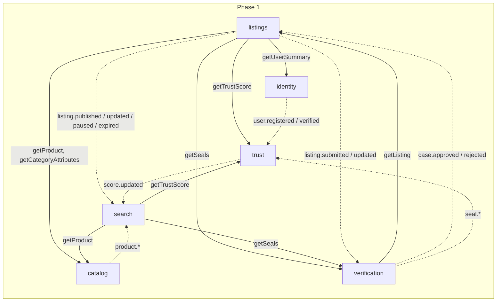

# Module Map — GamerTrust Backend

feature: architecture-canon
doc: ARCH-002
status: Approved
version: 0.1.1
owner: Architecture
jira: N/A
createdAt: 2026-08-07
updatedAt: 2026-08-07
approvedBy: Plan execution gate (Ralph Loops Fase 1)
approvedAt: 2026-08-07

Module rules: [01-modular-monolith.md](01-modular-monolith.md). Communication semantics: [03-inter-module-communication.md](03-inter-module-communication.md). Product sources: `context/GamerTrust-00..08` (pt-BR; term mapping in [08-glossary.md](08-glossary.md)).

## Module index

`MVP-detail = yes` means this doc set specifies the module's collections, ports, and events normatively for Phase 1. All other rows are macro-level and must be refined through a feature spec (`docs/specs/<feature-slug>/`) before implementation.

| Module (slug) | Phase | Owns (collections) | Publishes (events) | Consumes (events) | Sync ports exposed | MVP-detail |
|---------------|-------|--------------------|--------------------|-------------------|--------------------|------------|
| `identity` | 1 | `users`, `profiles` | `identity.user.registered`, `identity.user.verified` | — | `IIdentityClient.getUserSummary(userId)` | yes |
| `catalog` | 1 | `products`, `categories`, `services`, `category_attribute_schemas`, `price_history` (until P3 — DEC-023). Master-data synonyms live on `categories`/`services` (DEC-024) | `catalog.product.created`, `catalog.product.updated`, `catalog.category.created`, `catalog.category.updated`, `catalog.service.created`, `catalog.service.updated` | — | `ICatalogClient.getProduct(productId)`, `ICatalogClient.getCategory(categoryId)`, `ICatalogClient.getService(serviceId)`, `ICatalogClient.getCategoryAttributes(categoryId)` | yes |
| `listings` | 1 | `listings` (one physical unit each), `listing_events` (state history) | `listings.listing.submitted`, `listings.listing.published`, `listings.listing.updated`, `listings.listing.paused`, `listings.listing.expired`; P2: `listings.listing.reserved`, `listings.listing.sold` | `verification.case.approved`, `verification.case.rejected`; P2: `orders.order.cancelled` | `IListingsClient.getListing(listingId)`; P2: `IListingsClient.reserve(listingId, orderId)`, `IListingsClient.release(listingId, orderId)` | yes |
| `verification` | 1 | `verification_cases`, `evidence_items`, `seals` | `verification.case.submitted`, `verification.case.approved`, `verification.case.rejected`, `verification.seal.granted`, `verification.seal.suspended`, `verification.seal.expired`, `verification.seal.revoked` | `listings.listing.submitted`, `listings.listing.updated` (re-verification trigger) | `IVerificationClient.getSeals(listingId)` | yes |
| `trust` | 1 | `trust_scores`, `trust_events` (append-only ledger), `seller_levels` | `trust.score.updated` | `verification.seal.granted`, `verification.seal.revoked`, `identity.user.verified`; P2: `orders.order.completed`, `orders.order.cancelled`, `disputes.dispute.resolved`, `reviews.review.submitted` | `ITrustClient.getTrustScore(sellerId)` | yes |
| `search` | 1 | `search_documents` (read model; vector field in P3), `synonyms` (operational projection of catalog taxonomy aliases — DEC-024; not master data), `query_logs` | `search.zero-result.recorded` | `listings.listing.published`, `listings.listing.updated`, `listings.listing.paused`, `listings.listing.expired`, `listings.listing.sold` (P2), `catalog.product.updated`, `catalog.category.created`, `catalog.category.updated`, `catalog.service.created`, `catalog.service.updated`, `trust.score.updated` | — (public REST only: `/search`, `/autocomplete`) | yes |
| `favorites` | 1 (alerts P2) | `favorites`; P2: `saved_searches`, `alerts` | P2: `favorites.alert.triggered` | P2: `listings.listing.updated` (price drop), `listings.listing.published` (new offer for model), `search.zero-result.recorded` | — | yes |
| `orders` | 2 | `orders`, `negotiations` (offer/counteroffer), `delivery_codes` | `orders.order.created`, `orders.order.confirmed`, `orders.order.shipped`, `orders.order.delivered`, `orders.order.completed`, `orders.order.cancelled`, `orders.offer.made`, `orders.offer.countered`, `orders.offer.accepted`, `orders.offer.declined` | `payments.escrow.held`, `payments.escrow.released`, `payments.escrow.refunded`, `payments.escrow.failed`, `disputes.dispute.resolved` | `IOrdersClient.getOrder(orderId)`, `IOrdersClient.isCompletedPurchase(orderId, buyerId)` | no |
| `payments` | 2 | `payments`, `escrow_holds`, `refunds`, `payout_accounts` | `payments.escrow.held`, `payments.escrow.released`, `payments.escrow.refunded`, `payments.escrow.failed` (FIFO — DEC-051) | `orders.order.created`, `orders.order.completed`, `orders.order.cancelled`, `disputes.dispute.resolved` | `IPaymentsClient.getPaymentStatus(orderId)` | no |
| `disputes` | 2 | `disputes`, `dispute_evidence`, `appeals` | `disputes.dispute.opened`, `disputes.dispute.resolved`, `disputes.dispute.appealed` | `orders.order.delivered`, `orders.order.completed` (dispute-window control) | `IDisputesClient.getOpenDispute(orderId)` | no |
| `reviews` | 2 | `reviews` | `reviews.review.submitted` | `orders.order.completed` (eligibility) | — | no |
| `notifications` | 2 | `notifications`, `notification_preferences`, `notification_templates` | — | Broad subscription list (transactional vs promotional priority) — maintained in its feature spec | — | no |
| `ai` | 3 | `rag_documents`, `assistant_sessions`, `embedding_jobs` | `ai.moderation.flagged` | `catalog.product.*`, `listings.listing.*`, `reviews.review.submitted`, `verification.case.*` (corpus feed) | — | no |
| `pricing` | 3 | `price_points`, `price_suggestions`, `price_history` (from catalog — DEC-023) | `pricing.suggestion.updated` | `listings.listing.published`, `listings.listing.sold`, `orders.order.completed` | `IPricingClient.getSuggestedRange(productId, condition)` | no |
| `moderation` | 3 | `moderation_cases`, `audit_logs` | `moderation.action.taken` | `ai.moderation.flagged`, `verification.case.*`, `disputes.dispute.*` | — | no |
| `analytics` | 3–4 | `analytics_events` (sink), `experiment_assignments` | — | All events (firehose subscription) | — | no |
| `ads` | 4 | `campaigns`, `sponsored_placements` | — | `search.zero-result.recorded` (demand signals) | — | no |

### Explicit non-modules

These product capabilities are **compositions over existing module surfaces**, not modules — they own no collections and publish no events:

- **Seller dashboard** — read-model composition over `listings`, `orders`, `trust`, `pricing` ports.
- **Offer comparator** — composition over `listings` + `catalog` + `verification` reads.
- **Phase 4 ecosystem items** (optional warranty, integrated logistics, certified diagnosis, buyback, trade-in): placeholder only; each gets a feature spec (and possibly a module row) when scheduled.

## Phase view

| Phase | Modules active |
|-------|----------------|
| 1 — Discovery & Trust (MVP) | identity, catalog, listings, verification, trust, search, favorites |
| 2 — Purchase & Reputation | + orders, payments, disputes, reviews, notifications; favorites gains alerts |
| 3 — Differentiated Search & AI | + ai, pricing, moderation; search gains vector/NL | 
| 4 — Ecosystem | + ads, analytics matured; ecosystem items via new specs |

## Data ownership rules

1. **One collection has exactly one owning module** — the owner is the only module that writes to it (via its own repositories).
2. Other modules access that data only through the owner's **sync ports** or **event-fed read models** ([03](03-inter-module-communication.md)); never by importing the owner's models, schemas, or repositories.
3. Read models (e.g. `search_documents`) are owned by the consuming module, and are disposable/rebuildable per DEC-043 ([04](04-persistence-and-consistency.md)).
4. Collection names are `snake_case`, no module prefix — ownership is recorded in this table, not encoded in the name.
5. Ownership changes (hand-offs) must be recorded in this doc **before** implementation starts.

### Taxonomy master data (DEC-024)

- `categories` and `services` are the **unique canonical bases** for product taxonomy and marketplace service taxonomy.
- Each entity has: `id`, `slug` (unique per collection), `name` (canonical, unique per collection), `synonyms[]` (normalized), `status`, timestamps.
- Synonym uniqueness is **global across `categories ∪ services`**: a normalized synonym maps to exactly one entity (enforced in catalog Service → 409).
- Catalog is the source of truth for synonyms; `search.synonyms` is a rebuildable projection fed by `catalog.category.*` / `catalog.service.*` events.

## Event catalog

Canonical names follow `<module>.<aggregate>.<past-tense-verb>` (DEC-031). The authoritative publisher/consumer mapping is the module index above; transport details (topics, queues, FIFO) live in [05-sqs-messaging.md](05-sqs-messaging.md). Highlights:

| Event | Publisher | Known consumers (phase) |
|-------|-----------|-------------------------|
| `listings.listing.submitted` | listings | verification (1) |
| `listings.listing.published` | listings | search (1), favorites (2), ai (3), pricing (3) |
| `listings.listing.updated` | listings | verification (1, re-verification), search (1), favorites (2) |
| `listings.listing.paused` / `.expired` | listings | search (1) |
| `listings.listing.reserved` / `.sold` | listings | search (2), pricing (3) |
| `verification.case.approved` / `.rejected` | verification | listings (1, publish gate) |
| `verification.seal.granted` / `.suspended` / `.expired` / `.revoked` | verification | trust (1), search (1, via trust score or direct) |
| `identity.user.registered` / `.verified` | identity | trust (1) |
| `trust.score.updated` | trust | search (1) |
| `catalog.product.created` / `.updated` | catalog | search (1), ai (3) |
| `catalog.category.created` / `.updated` | catalog | search (1) — synonym projection |
| `catalog.service.created` / `.updated` | catalog | search (1) — synonym projection |
| `search.zero-result.recorded` | search | favorites (2), ads (4) |
| `orders.order.*`, `orders.offer.*` | orders | payments, disputes, reviews, trust, listings (2) |
| `payments.escrow.*` | payments | orders (2), trust (2) — FIFO |
| `disputes.dispute.*` | disputes | orders, payments, trust, moderation (2–3) |
| `reviews.review.submitted` | reviews | trust (2), ai (3) |

## Sync port catalog

Port pattern (consumer-owned interface, in-process adapter) is defined in [03 §Sync](03-inter-module-communication.md). Ports exposed per supplier:

| Supplier | Port | Known consumers (phase) |
|----------|------|-------------------------|
| identity | `IIdentityClient.getUserSummary(userId)` | listings (1), orders (2), disputes (2) |
| catalog | `ICatalogClient.getProduct(productId)` | listings (1), search (1), pricing (3) |
| catalog | `ICatalogClient.getCategory(categoryId)` | listings (1), search (1) |
| catalog | `ICatalogClient.getService(serviceId)` | listings (1), search (1) |
| catalog | `ICatalogClient.getCategoryAttributes(categoryId)` | listings (1), search (1) |
| listings | `IListingsClient.getListing(listingId)` | orders (2), disputes (2), verification (1) |
| listings | `IListingsClient.reserve/release(listingId, orderId)` | orders (2) |
| verification | `IVerificationClient.getSeals(listingId)` | listings (1, render), search (1) |
| trust | `ITrustClient.getTrustScore(sellerId)` | listings (1, render), search (1), orders (2) |
| orders | `IOrdersClient.getOrder(orderId)`, `.isCompletedPurchase(orderId, buyerId)` | reviews (2), disputes (2), payments (2) |
| payments | `IPaymentsClient.getPaymentStatus(orderId)` | orders (2) |
| disputes | `IDisputesClient.getOpenDispute(orderId)` | payments (2), orders (2) |
| pricing | `IPricingClient.getSuggestedRange(productId, condition)` | listings (3) |

## Module dependency diagram

Solid arrows = sync ports (must stay **acyclic** — DEC-022); dashed = events (cycles acceptable, consumers idempotent). Phase 1 scope:

Note: `verification → listings (getListing)` and `listings → verification (getSeals)` would form a sync cycle. It is broken as follows: `verification` reads listing data from the **event payload** of `listings.listing.submitted` (facts at submission time) and only uses `IListingsClient.getListing` for on-demand moderation views; `listings` may cache seal state from `verification.seal.*` events for rendering instead of calling `getSeals` on the hot path. Feature specs must preserve acyclicity of *required* sync paths.

## Ownership hand-offs and open items

| Item | Detail |
|------|--------|
| `price_history` (DEC-023) | Owned by `catalog` in Phases 1–2 (simple append on sale/publish). In Phase 3, `pricing` assumes ownership via a documented migration (collection handover + event replay); catalog keeps a read port until consumers migrate. |
| `notifications` subscription list | The full event subscription list is deferred to the notifications feature spec (Phase 2); this map only fixes that notifications **consumes** and never publishes domain events. |
| `analytics` ingestion | Firehose-style subscription to all topics; must never become a sync dependency of any module. |

## Decisions

| ID | Decision | Chosen | Rejected alternatives | Status |
|----|----------|--------|-----------------------|--------|
| DEC-020 | Module consolidation | 17 modules across 4 phases; dashboard/comparator/collections are read-model compositions, not modules | One module per product doc section (~25, too fragmented); a single `marketplace` module (no boundaries) | Approved |
| DEC-021 | MVP detail set | identity, catalog, listings, verification, trust, search, favorites specified normatively for Phase 1 | Detailing all 17 now (rework risk as product evolves) | Approved |
| DEC-022 | Sync dependency shape | Sync-port graph must be acyclic; cycles broken with events/read models (see diagram note) | Allowing bidirectional sync ports (blocks future extraction; deadlock-prone sagas) | Approved |
| DEC-023 | `price_history` ownership | catalog (P1–2) → pricing (P3) with documented migration | Creating `pricing` in Phase 1 just to hold one collection | Approved |
| DEC-024 | Taxonomy master data | Unique `categories` + `services` in catalog; synonyms on entities; global synonym uniqueness across both; search.synonyms is projection only | Synonyms owned only by search (ambiguous edits); services outside catalog; allowing duplicate synonyms | Approved |

## Approval

- Gate: APPROVED
- Approver: Plan execution gate (Ralph Loops Fase 1) + Loop 01a taxonomy delta
- Date: 2026-08-07

## Changelog

| Version | Date | Change |
|---------|------|--------|
| 0.1.1 | 2026-08-07 | DEC-024: `services` collection, category/service events & ports, synonym ownership |
| 0.1.0 | 2026-08-07 | Initial module map from context/GamerTrust-00..08 |
