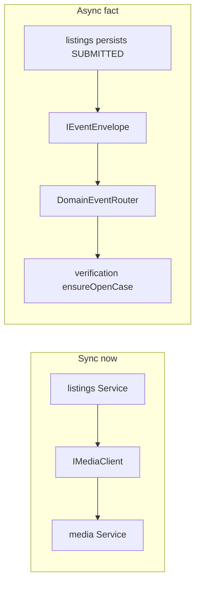

# Inter-module communication

How GamerTrust modules talk **without importing each other’s models**. Normative: [docs/architecture/03-inter-module-communication.md](../../architecture/03-inter-module-communication.md) (ARCH-003). Transport: [messaging](./messaging.md). Portuguese: [pt-BR](../../pt-BR/architecture/communication.md).

Direct imports across `src/domain/<A>` → `src/domain/<B>` are forbidden ([ARCH-001](../../architecture/01-modular-monolith.md)). The only shared kernel is `src/domain/common/` (errors, envelope, `ActorContext`).

## Choose a mechanism

| Situation | Mechanism |
|-----------|-----------|
| Caller needs the answer **now** (validate a product exists, assert a media asset is attachable) | **Sync client port** |
| A module announces a **fact that already happened**; others react later | **Domain event** (async) |
| “Do this as part of my Mongo transaction in another module” | **Not allowed** — remodel as event + compensation, or move the rule to the owner |
| Continuous derived data (search over listings) | **Event-fed read model** owned by the consumer (DEC-043) |

Prefer events. A sync port is a runtime dependency: after extraction, if the supplier is down, the consumer degrades. New sync edges must stay **acyclic** (DEC-022).

## Sync: client ports

In-process, HTTP-shaped calls (DEC-030). Pattern matches repositories (consumer owns the contract):

1. **Consumer defines** `src/domain/<consumer>/client/<supplier>.client.interface.ts` with only the methods and DTO fields it needs. Field names mirror the supplier’s OpenAPI schemas so a future HTTP adapter stays honest.
2. **Infra implements** `src/infraestructure/client/<supplier>/<supplier>.client.inprocess.ts` — the one sanctioned crossing: it may import the **supplier service interface** and map results. Supplier domain types do not leak through the port.
3. **Factory wires** `src/configuration/factory/client/` and injects the port into the consumer’s service factory.
4. **Consumer service** depends on the interface only.

Example in this codebase: listings / catalog / verification call [`IMediaClient`](../../../src/domain/media/client/media.client.ts) (`assertAttachableAsset`, `getReadyAsset`, public URL resolvers). `ActorContext` (or owner id) is an **explicit argument** — no ambient authority. The supplier re-applies ownership (DEC-070).

When a module is extracted to a service, swap the in-process adapter for an HTTP client against the same OpenAPI schema. Domain code does not change.

### Phase 1 ports (planned vs used)

Canon catalog: [ARCH-002 §Sync port catalog](../../architecture/02-module-map.md#sync-port-catalog). Implemented today and used on the hot path includes **`IMediaClient`** from listings, catalog, and verification. Other ports (`ICatalogClient`, `ITrustClient`, …) remain the target shape — do not invent a direct `TrustService` import from listings.

Sync cycle to avoid: `verification → listings.getListing` **and** `listings → verification.getSeals` on the same required path. Verification should take listing facts from `listings.listing.submitted` payload; listings should cache seal state from `verification.seal.*` events rather than calling `getSeals` on every PDP render.

## Async: domain events

Events are **facts**, never commands (`listings.listing.published` is correct; `search.index.update` is not).

- **Name:** `<module>.<aggregate>.<past-tense-verb>` (DEC-031).
- **Payload:** ids, status, timestamps, fields consumers need. **No PII** (DEC-072). No supplier entity classes. If a consumer needs more, it calls a sync port under a **system** actor.
- **Contract:** producer types live in `src/domain/<module>/messaging/<event>/producer.interface.ts` (see identity’s [`identity.user.registered`](../../../src/domain/identity/messaging/identity.user.registered/producer.interface.ts)). Consumers import the **payload type**, not the producer class.

Envelope, SNS/SQS, handlers, and the as-is catalog: **[messaging](./messaging.md)**.

## Actor context

| Path | Who is the actor |
|------|------------------|
| HTTP | Built from the access JWT in application middleware; Service uses it for ownership |
| Sync port | Explicit `ActorContext` (or `ownerId`) on the method |
| Event handler | **System** actor; `correlationId` is for tracing only |

## Related

- [Messaging (async runtime)](./messaging.md)
- [Module map](./modules.md)
- [Layers](./layers.md)
- [Security](./security.md)
