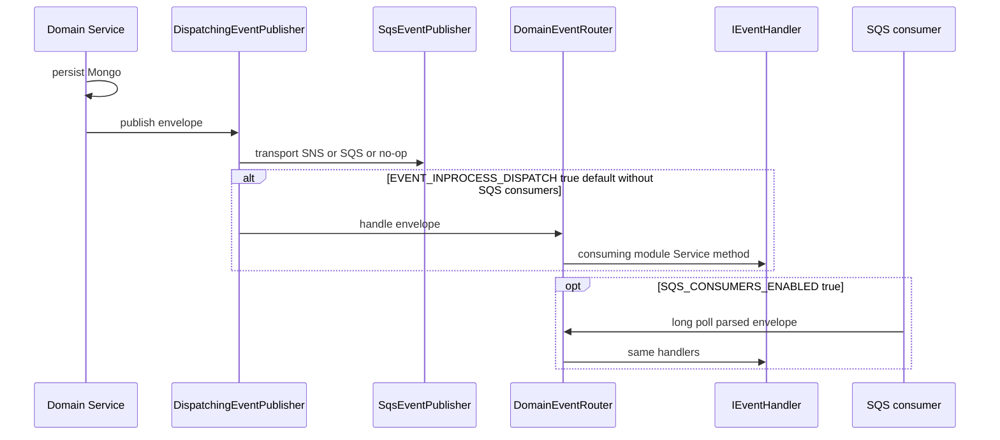
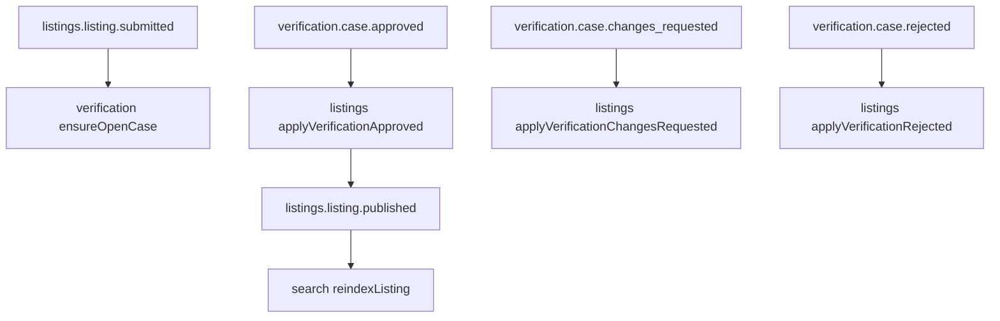

# Messaging (asynchronous)

Runtime for **domain events**: envelope, in-process dispatch, SNS/SQS, handlers, env, tests. Communication *choice* (sync vs async): [communication](./communication.md). Canon: [ARCH-005](../../architecture/05-sqs-messaging.md) and [ARCH-003](../../architecture/03-inter-module-communication.md). Portuguese: [pt-BR](../../pt-BR/architecture/messaging.md).

Do **not** document Kafka as the current transport. The domain never names SQS/SNS (DEC-052). Kit examples may mention Kafka; this service uses **SNS + SQS**.

## End-to-end publish



Order: **persist first, then publish** (DEC-033, Phase 1). A crash between the two can lose an event. Phase 1 consumers are rebuildable read models (`search_documents`, synonym projection) plus idempotent case open / auto-publish. Phase 2 money events require a transactional outbox before they ship.

## Envelope

Typed in [`src/domain/common/messaging/event-envelope.ts`](../../../src/domain/common/messaging/event-envelope.ts). Every message is `IEventEnvelope`:

| Field | Type | Meaning |
|-------|------|---------|
| `eventId` | uuid | Unique per message; future dedupe key |
| `eventType` | string | Canonical name (`listings.listing.published`) |
| `schemaVersion` | int | Starts at 1; additive fields keep the version; breaking change dual-publishes |
| `occurredAt` | ISO-8601 | Time of the **domain fact**, not of the SNS call |
| `aggregateId` | string | Aggregate the fact is about (FIFO group key later) |
| `producerModule` | string | Module slug (`listings`, `identity`, …) |
| `correlationId` | uuid | From the originating request / saga (tracing) |
| `payload` | object | Facts only |

Example payload for identity (no email, no CPF):

```ts
type IIdentityUserRegisteredPayload = { userId: string };
```

## Layers and files

| Layer | Responsibility | Example |
|-------|----------------|---------|
| Domain contract | Payload + `I*Producer` / `IEventHandler` | `src/domain/identity/messaging/identity.user.registered/producer.interface.ts` |
| Domain handler | Parse envelope → **Service method** (no AWS) | `src/domain/search/messaging/handlers/search-listing-event.handler.ts` |
| Domain kernel | Envelope, `IEventPublisher`, `DomainEventRouter`, `DispatchingEventPublisher` | `src/domain/common/messaging/` |
| Infra | SNS publish, SQS long-poll, parse JSON | `src/infraestructure/messaging/sqs/sqs-event-publisher.ts`, `sqs-event-consumer.ts` |
| Configuration | Wire publisher, router, consumers; named env | `src/configuration/factory/messaging/`, `env-constants/messaging.env.ts` |

The infra consumer **only** receives, parses, and delegates. Delete the SQS message **after** the handler succeeds; on failure, visibility timeout expires (retry → DLQ in the target topology).

## Two runtimes (local vs broker)

[`DispatchingEventPublisher`](../../../src/domain/common/messaging/dispatching-event-publisher.ts) always calls the transport, then optionally the same `DomainEventRouter`.

| Mode | When | Behaviour |
|------|------|-----------|
| **In-process** | Default when `SQS_CONSUMERS_ENABLED` is not `true` (`EVENT_INPROCESS_DISPATCH` unset) | After persist, handlers run in the same process. `SqsEventPublisher` is a **no-op** if `NODE_ENV=test`, `MESSAGING_DISABLED=true`, or neither `SNS_TOPIC_ARN` nor `SQS_QUEUE_URL` is set (`yarn dev` without broker). |
| **SQS consumers** | `SQS_CONSUMERS_ENABLED=true` plus queue URL(s) | Long-poll workers start after DB setup ([`MessagingConsumersFactory`](../../../src/configuration/factory/messaging/messaging-consumers.factory.ts)). In-process dispatch defaults to **off** so handlers do not run twice. |

Override: `EVENT_INPROCESS_DISPATCH=true|false`.

Jest **never** talks to a broker (DEC-053). Spy on `IEventPublisher` / producer interfaces; call handler methods with a built envelope. Optional LocalStack smoke is outside `yarn test`.

## Topology (target, ARCH-005)

**SNS topic per event type → SQS queue per (consumer module × event)** (DEC-050):

```text
listings.listing.published
        │
        ▼
 SNS  gt-<env>-listings-listing-published
        ├─ SQS gt-<env>-search-listings-listing-published
        ├─ SQS gt-<env>-favorites-listings-listing-published   (Phase 2)
        └─ SQS gt-<env>-ai-listings-listing-published        (Phase 3)
```

| Resource | Pattern |
|----------|---------|
| SNS topic | `gt-<env>-<event-type-dashed>` |
| SQS queue | `gt-<env>-<consumer-module>-<event-type-dashed>` |
| DLQ | queue name + `-dlq` (`maxReceiveCount` 5) |

**Standard queues by default.** FIFO (`MessageGroupId = aggregateId`) only for future `orders.*` / `payments.*` (DEC-051).

**Implemented publisher today:** one destination — `SNS_TOPIC_ARN` (preferred) or fallback `SQS_QUEUE_URL`. Message attribute `eventType` is set for SNS filtering. Per-event topics/queues are the architecture target; do not assume they already exist in every environment.

Local broker: `docker compose up -d localstack` (`SERVICES=sqs,sns,s3`). Point `AWS_ENDPOINT_URL` at LocalStack (typically `http://localhost:4566`).

## Env (named constants, not Domain)

From [`messaging.env.ts`](../../../src/configuration/env-constants/messaging.env.ts) and `SqsEventPublisher`:

| Variable | Role |
|----------|------|
| `MESSAGING_DISABLED` | `true` → publisher no-op |
| `SNS_TOPIC_ARN` | Publish via SNS |
| `SQS_QUEUE_URL` | Publish via SQS if no topic; also single consumer URL |
| `SQS_CONSUMER_QUEUE_URLS` | Comma-separated extra consumer queues |
| `SQS_CONSUMERS_ENABLED` | `true` → start pollers after Mongo |
| `EVENT_INPROCESS_DISPATCH` | Force in-process handler dispatch |
| `AWS_REGION` | Default `us-east-1` |
| `AWS_ENDPOINT_URL` | LocalStack endpoint |
| `NODE_ENV=test` | Publisher no-op |

Never put these in `src/domain/`.

## Handlers wired in this repo

Registered in [`DomainEventRouterFactory`](../../../src/configuration/factory/messaging/domain-event-router.factory.ts). Unknown `eventType` values are **ignored** (producers may emit ahead of consumers).

| Event | Handler | Effect |
|-------|---------|--------|
| `listings.listing.submitted` | `VerificationListingSubmittedHandler` | `ensureOpenCaseForListing` (idempotent) |
| `listings.listing.status_changed` (to `SUBMITTED`) | same | same |
| `listings.listing.published` | `SearchListingEventHandler` | `reindexListing` |
| `listings.listing.paused` | same | `deleteOnUnpublish` |
| `listings.listing.status_changed` (to `PUBLISHED` / `PAUSED`) | same | reindex or delete |
| `catalog.category.created` / `.updated` | `TaxonomySynonymEventHandler` | rebuild synonym projection |
| `catalog.service.created` / `.updated` | same | same |
| `verification.case.approved` | `ListingsVerificationApprovedHandler` | `applyVerificationApproved` (auto-publish path) |
| `verification.case.changes_requested` | `ListingsVerificationChangesRequestedHandler` | `applyVerificationChangesRequested` (`SUBMITTED→DRAFT`) |
| `verification.case.rejected` | `ListingsVerificationRejectedHandler` | `applyVerificationRejected` (`SUBMITTED→REJECTED`) |
| `listings.listing.submitted` | `AiListingSubmittedHandler` | triggers listing AI analysis |
| `listings.listing.updated` | `AiListingUpdatedHandler` | re-analysis when applicable |
| `media.asset.processed` | `AiListingMediaProcessedHandler` | analysis after media READY |
| `ai.listing.analyzed` | `AiListingAnalyzedHandler` | persists score/checklist on case |
| `verification.seal.granted` / `.revoked` | `SearchListingEventHandler` | reindex with visible seal |
| `media.asset.uploaded` | `MediaAssetUploadedHandler` | `processUploadedAsset` |



## Events published (as-is) vs consumers

Services emit after successful writes. Not every type has a router handler yet.

| Event | Publisher (Service) | Router consumer today |
|-------|---------------------|------------------------|
| `identity.user.registered` / `.verified` | identity | none yet (trust planned) |
| `identity.profile.updated` | identity | none yet |
| `catalog.product.created` / `.updated` | catalog | none yet (search planned) |
| `catalog.category.*` / `catalog.service.*` | catalog | search synonyms |
| `listings.listing.created` | listings | none yet |
| `listings.listing.status_changed` + `.submitted` / `.published` / `.paused` | listings | verification + search |
| `verification.case.submitted` | verification | none yet |
| `verification.case.approved` | verification | listings auto-publish |
| `verification.case.changes_requested` | verification | listings `SUBMITTED→DRAFT` |
| `verification.case.rejected` | verification | listings `SUBMITTED→REJECTED` |
| `verification.seal.granted` / `.revoked` | verification | search reindex |
| `ai.listing.analyzed` | ai | updates case checklist |
| `trust.score.updated` | trust | none yet (search planned) |
| `search.zero-result.recorded` | search | none yet (Phase 2 favorites) |
| `favorites.favorite.created` | favorites | none yet |
| `media.asset.uploaded` | media | media processing |
| `media.asset.processed` | media | none yet |

Full product catalog (including Phase 2–4): [ARCH-002 §Event catalog](../../architecture/02-module-map.md#event-catalog).

## Idempotency (DEC-032)

Transport is **at-least-once**. Duplicates and reordering (standard queues) are normal.

| Pattern | Use |
|---------|-----|
| Upsert keyed by `aggregateId`, apply-if-newer via `occurredAt` | Read models (search, synonyms) |
| Per-module `processed_events` (`eventId` unique) | Side effects that must not repeat (future payouts) |

`ensureOpenCaseForListing` is idempotent: a duplicate `submitted` must not open a second case.

## How to add an event

1. Name it `<module>.<aggregate>.<past-tense-verb>`.
2. Add payload + producer interface under `src/domain/<module>/messaging/<event>/`.
3. Publish from the **Service** after persist, via injected `IEventPublisher` / typed producer. Envelope via `createEventEnvelope`.
4. If something must react now, add `IEventHandler` in the **consuming** module and register it in `DomainEventRouterFactory`.
5. Keep PII out of the payload. Tests: spy publisher + call handler with a fixture envelope.
6. Update this page and the module guide in **both** `docs/en` and `docs/pt-BR`.

## Related

- [Communication (sync vs async)](./communication.md)
- [Modules](./modules.md)
- [Getting started](../getting-started.md)
- [How to document an endpoint](../contributing.md)
