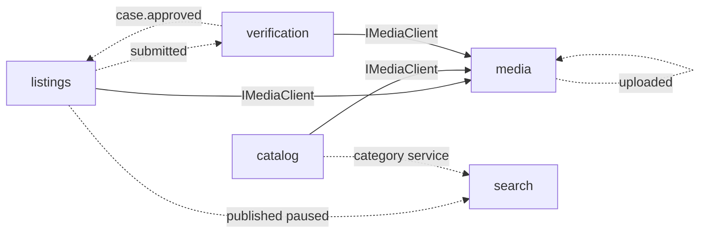

# Module map

Bounded contexts, data ownership, HTTP, **events**, and **ports**. Normative table: [docs/architecture/02-module-map.md](../../architecture/02-module-map.md) (ARCH-002). Portuguese: [pt-BR](../../pt-BR/architecture/modules.md).

A **module** owns its collections, domain services, REST prefix, and events. Other modules talk through **sync ports** or **events** — never by importing another module’s models or repositories ([ARCH-001](../../architecture/01-modular-monolith.md)). How to choose: [communication](./communication.md). Runtime: [messaging](./messaging.md).

## Phase 1 (implemented)

| Module | Owns (collections) | HTTP prefix (examples) | Guide |
|--------|--------------------|------------------------|-------|
| `identity` | `users`, `profiles`, `credentials`, `refresh_sessions` | `/auth/*`, `/users`, `/profiles`, `/cep` | [identity](../modules/identity.md) |
| `catalog` | `products`, `categories`, `services`, `category_attribute_schemas`, `price_history` | `/products`, `/categories`, `/services` | [catalog](../modules/catalog.md) |
| `listings` | `listings`, `listing_events` | `/listings` | [listings](../modules/listings.md) |
| `verification` | `verification_cases`, `evidence_items`, `seals` | `/verification-cases`, `/seals` | [verification](../modules/verification.md) |
| `trust` | `trust_scores`, `trust_events`, `seller_levels` | `/trust-scores`, `/trust-events`, `/seller-levels` | [trust](../modules/trust.md) |
| `search` | `search_documents`, `synonyms`, `query_logs` | `/search`, `/synonyms` | [search](../modules/search.md) |
| `favorites` | `favorites` | `/favorites` | [favorites](../modules/favorites.md) |
| `media` | `media_assets` | `/media` | [media](../modules/media.md) |

## Ownership rules

1. One collection has exactly one owning module (the only writer).
2. Cross-module reads use the owner’s port or an event-fed read model.
3. Read models (e.g. `search_documents`) are disposable and rebuildable (DEC-043). `POST /search/reconcile` is the operational rebuild.
4. **Product ≠ Listing**: catalog `products` are models; `listings` are units for sale.
5. Taxonomy master data (DEC-024): unique `categories` + `services`; synonyms on those entities; `search.synonyms` is a projection fed by `catalog.category.*` / `catalog.service.*`.

## Later phases (not HTTP in this MVP)

orders, payments, disputes, reviews, notifications (Phase 2); ai, pricing, moderation (Phase 3); ads, analytics (Phase 4). See the canon module index.

## Events (Phase 1 — as implemented)

Naming: `<module>.<aggregate>.<past-tense-verb>` (DEC-031). **Wired consumers** are those registered in `DomainEventRouterFactory`. Others are published for future modules.

| Event | Publisher | Wired consumer | Planned (canon) |
|-------|-----------|----------------|-----------------|
| `identity.user.registered` / `.verified` | identity | — | trust |
| `identity.profile.updated` | identity | — | — |
| `catalog.product.created` / `.updated` | catalog | — | search |
| `catalog.category.created` / `.updated` | catalog | search (synonyms) | — |
| `catalog.service.created` / `.updated` | catalog | search (synonyms) | — |
| `listings.listing.created` | listings | — | — |
| `listings.listing.submitted` + `status_changed` | listings | verification (open case) | — |
| `listings.listing.published` / `.paused` | listings | search (index / drop) | favorites P2 |
| `verification.case.submitted` | verification | — | — |
| `verification.case.approved` | verification | listings (auto-publish) | — |
| `verification.seal.granted` / `.revoked` | verification | — | trust |
| `trust.score.updated` | trust | — | search |
| `search.zero-result.recorded` | search | — | favorites P2 |
| `favorites.favorite.created` | favorites | — | — |
| `media.asset.uploaded` | media | media (process) | — |
| `media.asset.processed` | media | — | listings / catalog / verification |

Happy path listing → search:

```text
submit listing
  → listings.listing.submitted
  → verification opens case
  → approve case
  → verification.case.approved
  → listings auto-publish
  → listings.listing.published
  → search reindexes
```

## Sync ports (Phase 1)

| Supplier | Port | Used for |
|----------|------|----------|
| media | `IMediaClient.assertAttachableAsset` / URL resolvers | listings, catalog, verification attach media |
| identity | `IIdentityClient.getUserSummary` (canon) | listings must not import UserModel |
| catalog | `ICatalogClient.getProduct` / attributes (canon) | listing draft validation |
| verification | `IVerificationClient.getSeals` (canon) | PDP — prefer event-cached seal |
| trust | `ITrustClient.getTrustScore` (canon) | PDP — prefer `trust.score.updated` projection |

Keep the **sync graph acyclic**. Detail: [communication](./communication.md).



Solid = sync; dashed = events.

## Related

- [Communication](./communication.md)
- [Messaging](./messaging.md)
- [HTTP conventions](./http-conventions.md)
- Entity catalog: [docs/entities](../../entities/INDEX.md)
