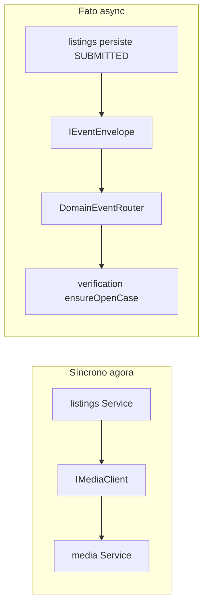

# Comunicação entre módulos

Como os módulos GamerTrust falam **sem importar models uns dos outros**. Normativo: [docs/architecture/03-inter-module-communication.md](../../architecture/03-inter-module-communication.md) (ARCH-003). Transporte: [mensageria](./messaging.md). Inglês: [en](../../en/architecture/communication.md).

Imports diretos `src/domain/<A>` → `src/domain/<B>` são proibidos ([ARCH-001](../../architecture/01-modular-monolith.md)). O único kernel compartilhado é `src/domain/common/` (erros, envelope, `ActorContext`).

## Escolher o mecanismo

| Situação | Mecanismo |
|----------|-----------|
| O caller precisa da resposta **agora** (produto existe? asset anexável?) | **Porta síncrona (client port)** |
| O módulo anuncia um **fato que já aconteceu**; outros reagem depois | **Evento de domínio** (async) |
| “Faça isso na transação Mongo de outro módulo” | **Proibido** — remodelar como evento + compensação, ou mover a regra para o dono |
| Dado derivado contínuo (busca sobre listings) | **Read model alimentado por evento**, dono do consumidor (DEC-043) |

Prefira eventos. Porta síncrona é dependência de runtime: depois da extração, se o supplier cair, o consumidor degrada. Novas arestas síncronas devem permanecer **acíclicas** (DEC-022).

## Síncrono: client ports

Chamadas in-process com shape HTTP (DEC-030). O padrão espelha repositórios (o consumidor dono do contrato):

1. **Consumidor define** `src/domain/<consumer>/client/<supplier>.client.interface.ts` só com métodos e DTOs que precisa. Nomes de campo espelham o OpenAPI do supplier para um adapter HTTP futuro continuar honesto.
2. **Infra implementa** `src/infraestructure/client/<supplier>/<supplier>.client.inprocess.ts` — o único cruzamento sancionado: pode importar a **interface do service do supplier** e mapear. Tipos de domínio do supplier não vazam pela porta.
3. **Factory liga** `src/configuration/factory/client/` e injeta no factory do service consumidor.
4. **Service consumidor** depende só da interface.

Exemplo neste código: listings / catalog / verification chamam [`IMediaClient`](../../../src/domain/media/client/media.client.ts) (`assertAttachableAsset`, `getReadyAsset`, resolvers de URL). `ActorContext` (ou `ownerId`) é **argumento explícito** — sem autoridade ambiente. O supplier reaplica ownership (DEC-070).

Quando o módulo virar serviço, troque o adapter in-process por um client HTTP contra o mesmo OpenAPI. O domínio não muda.

### Portas da Fase 1 (canon vs uso)

Catálogo: [ARCH-002 §Sync port catalog](../../architecture/02-module-map.md#sync-port-catalog). No hot path de hoje entra **`IMediaClient`**. Outras portas (`ICatalogClient`, `ITrustClient`, …) são o formato-alvo — não invente import direto de `TrustService` em listings.

Ciclo a evitar: `verification → listings.getListing` **e** `listings → verification.getSeals` no mesmo caminho obrigatório. Verification deve pegar fatos do payload de `listings.listing.submitted`; listings deve cachear selo a partir de `verification.seal.*` em vez de `getSeals` em todo render de PDP.

## Assíncrono: eventos de domínio

Eventos são **fatos**, nunca comandos (`listings.listing.published` está certo; `search.index.update` não).

- **Nome:** `<module>.<aggregate>.<past-tense-verb>` (DEC-031).
- **Payload:** ids, status, timestamps, campos que o consumidor precisa. **Sem PII** (DEC-072). Sem classes de entidade do supplier. Se precisar de mais, chama uma porta síncrona com ator **system**.
- **Contrato:** tipos do producer em `src/domain/<module>/messaging/<event>/producer.interface.ts` (ver [`identity.user.registered`](../../../src/domain/identity/messaging/identity.user.registered/producer.interface.ts)). Consumidores importam o **tipo do payload**, não a classe do producer.

Envelope, SNS/SQS, handlers e catálogo as-is: **[mensageria](./messaging.md)**.

## Actor context

| Caminho | Quem é o ator |
|---------|----------------|
| HTTP | Montado do JWT no middleware; o Service usa para ownership |
| Porta síncrona | `ActorContext` (ou `ownerId`) explícito no método |
| Handler de evento | Ator **system**; `correlationId` só para tracing |

## Relacionados

- [Mensageria (runtime async)](./messaging.md)
- [Mapa de módulos](./modules.md)
- [Camadas](./layers.md)
- [Segurança](./security.md)
