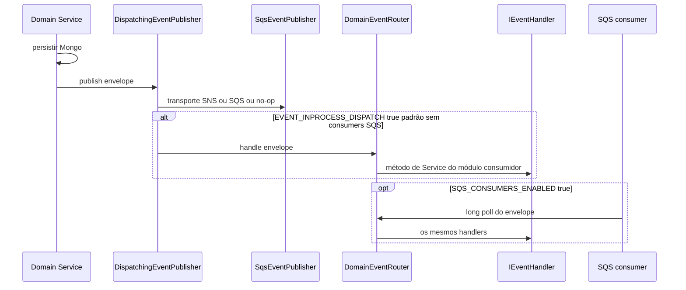
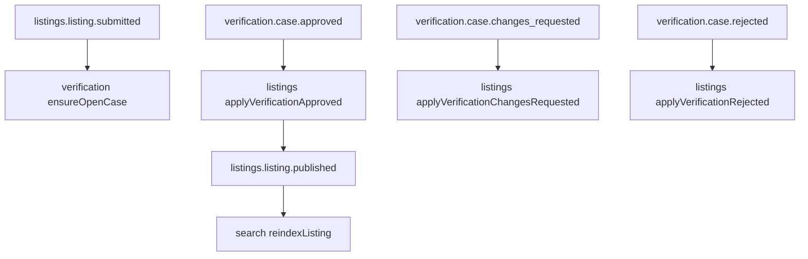

# Mensageria (assíncrona)

Runtime dos **eventos de domínio**: envelope, dispatch in-process, SNS/SQS, handlers, env, testes. Escolha sync vs async: [comunicação](./communication.md). Canon: [ARCH-005](../../architecture/05-sqs-messaging.md) e [ARCH-003](../../architecture/03-inter-module-communication.md). Inglês: [en](../../en/architecture/messaging.md).

**Não** documente Kafka como transporte atual. O domínio nunca nomeia SQS/SNS (DEC-052). Exemplos do kit podem citar Kafka; este serviço usa **SNS + SQS**.

## Publish ponta a ponta



Ordem: **persistir primeiro, depois publicar** (DEC-033, Fase 1). Crash entre os dois pode perder evento. Consumidores da Fase 1 são read models reconstruíveis (`search_documents`, projeção de sinônimos) mais abertura de caso / auto-publish idempotentes. Eventos de dinheiro na Fase 2 exigem outbox transacional antes de ir para produção.

## Envelope

Tipado em [`src/domain/common/messaging/event-envelope.ts`](../../../src/domain/common/messaging/event-envelope.ts). Toda mensagem é `IEventEnvelope`:

| Campo | Tipo | Significado |
|-------|------|-------------|
| `eventId` | uuid | Único por mensagem; chave de dedupe futura |
| `eventType` | string | Nome canônico (`listings.listing.published`) |
| `schemaVersion` | int | Começa em 1; campos aditivos mantêm a versão; breaking change faz dual-publish |
| `occurredAt` | ISO-8601 | Hora do **fato de domínio**, não da chamada SNS |
| `aggregateId` | string | Agregado do fato (depois, chave de grupo FIFO) |
| `producerModule` | string | Slug do módulo (`listings`, `identity`, …) |
| `correlationId` | uuid | Request / saga de origem (tracing) |
| `payload` | object | Só fatos |

Exemplo de payload de identity (sem email, sem CPF):

```ts
type IIdentityUserRegisteredPayload = { userId: string };
```

## Camadas e arquivos

| Camada | Responsabilidade | Exemplo |
|--------|------------------|---------|
| Contrato no domain | Payload + `I*Producer` / `IEventHandler` | `src/domain/identity/messaging/identity.user.registered/producer.interface.ts` |
| Handler no domain | Parse do envelope → **método de Service** (sem AWS) | `src/domain/search/messaging/handlers/search-listing-event.handler.ts` |
| Kernel | Envelope, `IEventPublisher`, `DomainEventRouter`, `DispatchingEventPublisher` | `src/domain/common/messaging/` |
| Infra | Publish SNS, long-poll SQS, parse JSON | `src/infraestructure/messaging/sqs/` |
| Configuration | Publisher, router, consumers; env nomeado | `src/configuration/factory/messaging/`, `env-constants/messaging.env.ts` |

O consumer de infra **só** recebe, faz parse e delega. Apaga a mensagem SQS **depois** do handler ok; em falha, o visibility timeout expira (retry → DLQ na topologia-alvo).

## Dois runtimes (local vs broker)

[`DispatchingEventPublisher`](../../../src/domain/common/messaging/dispatching-event-publisher.ts) sempre chama o transporte e, opcionalmente, o mesmo `DomainEventRouter`.

| Modo | Quando | Comportamento |
|------|--------|----------------|
| **In-process** | Padrão se `SQS_CONSUMERS_ENABLED` não for `true` (`EVENT_INPROCESS_DISPATCH` omitido) | Depois do persist, handlers rodam no mesmo processo. `SqsEventPublisher` é **no-op** se `NODE_ENV=test`, `MESSAGING_DISABLED=true`, ou não há `SNS_TOPIC_ARN` nem `SQS_QUEUE_URL` (`yarn dev` sem broker). |
| **Consumers SQS** | `SQS_CONSUMERS_ENABLED=true` e URL(s) de fila | Workers de long-poll sobem depois do Mongo ([`MessagingConsumersFactory`](../../../src/configuration/factory/messaging/messaging-consumers.factory.ts)). Dispatch in-process fica **desligado** por padrão para não duplicar handler. |

Override: `EVENT_INPROCESS_DISPATCH=true|false`.

Jest **nunca** fala com broker (DEC-053). Spy em `IEventPublisher`; chame o handler com envelope montado. Smoke com LocalStack fica fora de `yarn test`.

## Topologia (alvo, ARCH-005)

**Tópico SNS por tipo de evento → fila SQS por (módulo consumidor × evento)** (DEC-050):

```text
listings.listing.published
        │
        ▼
 SNS  gt-<env>-listings-listing-published
        ├─ SQS gt-<env>-search-listings-listing-published
        ├─ SQS gt-<env>-favorites-listings-listing-published   (Fase 2)
        └─ SQS gt-<env>-ai-listings-listing-published        (Fase 3)
```

| Recurso | Padrão |
|---------|--------|
| Tópico SNS | `gt-<env>-<event-type-dashed>` |
| Fila SQS | `gt-<env>-<consumer-module>-<event-type-dashed>` |
| DLQ | nome da fila + `-dlq` (`maxReceiveCount` 5) |

**Filas standard por padrão.** FIFO (`MessageGroupId = aggregateId`) só para futuros `orders.*` / `payments.*` (DEC-051).

**Publisher implementado hoje:** um destino — `SNS_TOPIC_ARN` (preferido) ou fallback `SQS_QUEUE_URL`. Atributo SNS `eventType` para filtro. Tópicos/filas por evento são o alvo de arquitetura; não assuma que já existem em todo ambiente.

Broker local: `docker compose up -d localstack` (`SERVICES=sqs,sns,s3`). `AWS_ENDPOINT_URL` no LocalStack (em geral `http://localhost:4566`).

## Env (constantes nomeadas, não Domain)

De [`messaging.env.ts`](../../../src/configuration/env-constants/messaging.env.ts) e `SqsEventPublisher`:

| Variável | Papel |
|----------|-------|
| `MESSAGING_DISABLED` | `true` → publisher no-op |
| `SNS_TOPIC_ARN` | Publish via SNS |
| `SQS_QUEUE_URL` | Publish via SQS se não houver tópico; também URL única de consumer |
| `SQS_CONSUMER_QUEUE_URLS` | Filas extras, separadas por vírgula |
| `SQS_CONSUMERS_ENABLED` | `true` → pollers depois do Mongo |
| `EVENT_INPROCESS_DISPATCH` | Força dispatch in-process |
| `AWS_REGION` | Padrão `us-east-1` |
| `AWS_ENDPOINT_URL` | Endpoint LocalStack |
| `NODE_ENV=test` | Publisher no-op |

Nunca coloque isso em `src/domain/`.

## Handlers ligados neste repo

Registrados em [`DomainEventRouterFactory`](../../../src/configuration/factory/messaging/domain-event-router.factory.ts). `eventType` desconhecido é **ignorado** (producer pode emitir antes do consumer).

| Evento | Handler | Efeito |
|--------|---------|--------|
| `listings.listing.submitted` | `VerificationListingSubmittedHandler` | `ensureOpenCaseForListing` (idempotente) |
| `listings.listing.status_changed` (para `SUBMITTED`) | o mesmo | o mesmo |
| `listings.listing.published` | `SearchListingEventHandler` | `reindexListing` |
| `listings.listing.paused` | o mesmo | `deleteOnUnpublish` |
| `listings.listing.status_changed` (para `PUBLISHED` / `PAUSED`) | o mesmo | reindex ou delete |
| `catalog.category.created` / `.updated` | `TaxonomySynonymEventHandler` | reconstrói projeção de sinônimos |
| `catalog.service.created` / `.updated` | o mesmo | o mesmo |
| `verification.case.approved` | `ListingsVerificationApprovedHandler` | `applyVerificationApproved` (auto-publish) |
| `verification.case.changes_requested` | `ListingsVerificationChangesRequestedHandler` | `applyVerificationChangesRequested` (`SUBMITTED→DRAFT`) |
| `verification.case.rejected` | `ListingsVerificationRejectedHandler` | `applyVerificationRejected` (`SUBMITTED→REJECTED`) |
| `listings.listing.submitted` | `AiListingSubmittedHandler` | dispara análise IA do listing |
| `listings.listing.updated` | `AiListingUpdatedHandler` | re-análise quando aplicável |
| `media.asset.processed` | `AiListingMediaProcessedHandler` | análise após mídia READY |
| `ai.listing.analyzed` | `AiListingAnalyzedHandler` | persiste score/checklist no caso |
| `verification.seal.granted` / `.revoked` | `SearchListingEventHandler` | reindex com selo visível |
| `media.asset.uploaded` | `MediaAssetUploadedHandler` | `processUploadedAsset` |



## Eventos publicados (as-is) vs consumers

Services emitem depois do write. Nem todo tipo tem handler no router.

| Evento | Publisher (Service) | Consumer no router hoje |
|--------|---------------------|-------------------------|
| `identity.user.registered` / `.verified` | identity | ainda não (trust planejado) |
| `identity.profile.updated` | identity | ainda não |
| `catalog.product.created` / `.updated` | catalog | ainda não (search planejado) |
| `catalog.category.*` / `catalog.service.*` | catalog | search sinônimos |
| `listings.listing.created` | listings | ainda não |
| `listings.listing.status_changed` + `.submitted` / `.published` / `.paused` | listings | verification + search |
| `verification.case.submitted` | verification | ainda não |
| `verification.case.approved` | verification | listings auto-publish |
| `verification.case.changes_requested` | verification | listings `SUBMITTED→DRAFT` |
| `verification.case.rejected` | verification | listings `SUBMITTED→REJECTED` |
| `verification.seal.granted` / `.revoked` | verification | search reindex |
| `ai.listing.analyzed` | ai | atualiza checklist do caso |
| `trust.score.updated` | trust | ainda não (search planejado) |
| `search.zero-result.recorded` | search | ainda não (favoritos Fase 2) |
| `favorites.favorite.created` | favorites | ainda não |
| `media.asset.uploaded` | media | processamento de mídia |
| `media.asset.processed` | media | ainda não |

Catálogo de produto (Fases 2–4): [ARCH-002 §Event catalog](../../architecture/02-module-map.md#event-catalog).

## Idempotência (DEC-032)

Transporte é **at-least-once**. Duplicata e reordenação (filas standard) são normais.

| Padrão | Uso |
|--------|-----|
| Upsert por `aggregateId`, apply-if-newer via `occurredAt` | Read models (search, sinônimos) |
| `processed_events` por módulo (`eventId` unique) | Efeitos colaterais que não podem repetir (payouts futuros) |

`ensureOpenCaseForListing` é idempotente: `submitted` duplicado não abre segundo caso.

## Como adicionar um evento

1. Nome `<module>.<aggregate>.<past-tense-verb>`.
2. Payload + interface de producer em `src/domain/<module>/messaging/<event>/`.
3. Publish no **Service** depois do persist, via `IEventPublisher` / producer tipado. Envelope com `createEventEnvelope`.
4. Se alguém precisa reagir agora, `IEventHandler` no módulo **consumidor** e registro em `DomainEventRouterFactory`.
5. Sem PII no payload. Testes: spy no publisher + handler com envelope fixture.
6. Atualize esta página e o guia do módulo em **`docs/en` e `docs/pt-BR`**.

## Relacionados

- [Comunicação (sync vs async)](./communication.md)
- [Módulos](./modules.md)
- [Primeiros passos](../getting-started.md)
- [Como documentar um endpoint](../contributing.md)
