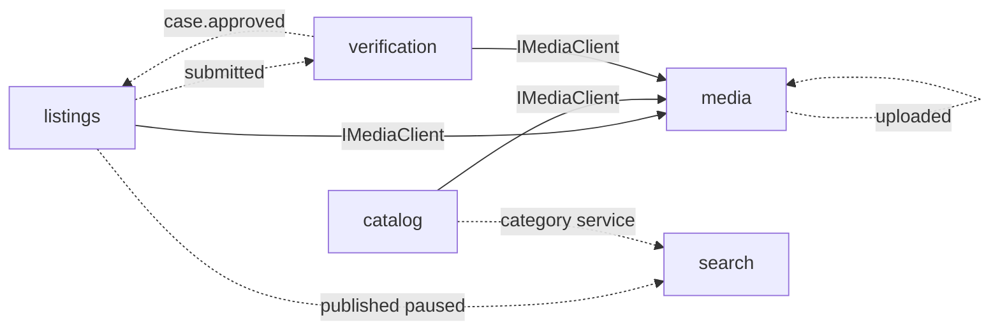

# Mapa de módulos

Bounded contexts, dono dos dados, HTTP, **eventos** e **portas**. Tabela normativa: [docs/architecture/02-module-map.md](../../architecture/02-module-map.md) (ARCH-002). Inglês: [en](../../en/architecture/modules.md).

Um **módulo** dono das collections, services, prefixo REST e eventos. Outros falam por **portas síncronas** ou **eventos** — nunca importando models ou repositórios alheios ([ARCH-001](../../architecture/01-modular-monolith.md)). Como escolher: [comunicação](./communication.md). Runtime: [mensageria](./messaging.md).

## Fase 1 (implementada)

| Módulo | Dono (collections) | Prefixo HTTP (exemplos) | Guia |
|--------|--------------------|-------------------------|------|
| `identity` | `users`, `profiles`, `credentials`, `refresh_sessions` | `/auth/*`, `/users`, `/profiles`, `/cep` | [identity](../modules/identity.md) |
| `catalog` | `products`, `categories`, `services`, `category_attribute_schemas`, `price_history` | `/products`, `/categories`, `/services` | [catalog](../modules/catalog.md) |
| `listings` | `listings`, `listing_events` | `/listings` | [listings](../modules/listings.md) |
| `verification` | `verification_cases`, `evidence_items`, `seals` | `/verification-cases`, `/seals` | [verification](../modules/verification.md) |
| `trust` | `trust_scores`, `trust_events`, `seller_levels` | `/trust-scores`, `/trust-events`, `/seller-levels` | [trust](../modules/trust.md) |
| `search` | `search_documents`, `synonyms`, `query_logs` | `/search`, `/synonyms` | [search](../modules/search.md) |
| `favorites` | `favorites` | `/favorites` | [favorites](../modules/favorites.md) |
| `media` | `media_assets` | `/media` | [media](../modules/media.md) |

## Regras de ownership

1. Uma collection tem exatamente um módulo dono (único writer).
2. Leituras entre módulos usam a porta do dono ou um read model alimentado por evento.
3. Read models (ex.: `search_documents`) são descartáveis e reconstruíveis (DEC-043). `POST /search/reconcile` é o rebuild operacional.
4. **Produto ≠ Oferta**: `products` são modelos; `listings` são unidades à venda.
5. Master data de taxonomia (DEC-024): `categories` + `services` únicos; sinônimos nessas entidades; `search.synonyms` é projeção alimentada por `catalog.category.*` / `catalog.service.*`.

## Fases seguintes (sem HTTP neste MVP)

orders, payments, disputes, reviews, notifications (Fase 2); ai, pricing, moderation (Fase 3); ads, analytics (Fase 4). Ver o índice no canon.

## Eventos (Fase 1 — como está no código)

Nome: `<module>.<aggregate>.<past-tense-verb>` (DEC-031). **Consumers ligados** são os registrados em `DomainEventRouterFactory`. Os demais são publicados para módulos futuros.

| Evento | Publisher | Consumer ligado | Planejado (canon) |
|--------|-----------|-----------------|-------------------|
| `identity.user.registered` / `.verified` | identity | — | trust |
| `identity.profile.updated` | identity | — | — |
| `catalog.product.created` / `.updated` | catalog | — | search |
| `catalog.category.created` / `.updated` | catalog | search (sinônimos) | — |
| `catalog.service.created` / `.updated` | catalog | search (sinônimos) | — |
| `listings.listing.created` | listings | — | — |
| `listings.listing.submitted` + `status_changed` | listings | verification (abre caso) | — |
| `listings.listing.published` / `.paused` | listings | search (índice / drop) | favorites P2 |
| `verification.case.submitted` | verification | — | — |
| `verification.case.approved` | verification | listings (auto-publish) | — |
| `verification.seal.granted` / `.revoked` | verification | — | trust |
| `trust.score.updated` | trust | — | search |
| `search.zero-result.recorded` | search | — | favorites P2 |
| `favorites.favorite.created` | favorites | — | — |
| `media.asset.uploaded` | media | media (processa) | — |
| `media.asset.processed` | media | — | listings / catalog / verification |

Caminho feliz listing → search:

```text
submit listing
  → listings.listing.submitted
  → verification abre caso
  → approve case
  → verification.case.approved
  → listings auto-publish
  → listings.listing.published
  → search reindexa
```

## Portas síncronas (Fase 1)

| Supplier | Porta | Uso |
|----------|-------|-----|
| media | `IMediaClient.assertAttachableAsset` / resolvers | listings, catalog, verification anexam mídia |
| identity | `IIdentityClient.getUserSummary` (canon) | listings não importa UserModel |
| catalog | `ICatalogClient.getProduct` / attributes (canon) | validação de draft |
| verification | `IVerificationClient.getSeals` (canon) | PDP — preferir selo cacheado por evento |
| trust | `ITrustClient.getTrustScore` (canon) | PDP — preferir projeção de `trust.score.updated` |

Grafo **síncrono acíclico**. Detalhe: [comunicação](./communication.md).



Sólido = sync; tracejado = eventos.

## Relacionados

- [Comunicação](./communication.md)
- [Mensageria](./messaging.md)
- [Convenções HTTP](./http-conventions.md)
- Catálogo de entidades: [docs/entities](../../entities/INDEX.md)
